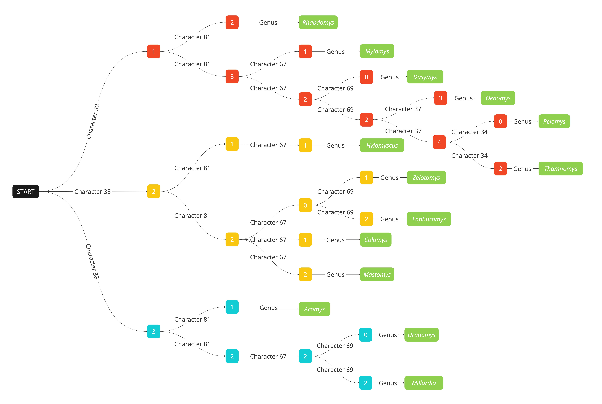

Loading in necessary packages:

```{r message=FALSE}
library(tidyverse)
library(knitr)
library(kableExtra)
```

Loading in data set:

```{r message=FALSE}
f <- "https://raw.githubusercontent.com/clairebran/ethnobio-poster-2024/main/African%20Murine%20Rodents%20Character%20State%20Matrix.csv"
rodent_data <- read_csv(f, col_names = TRUE)
```

# Shannon Information Content

Shannon information content is a measure in information theory which quantifies the degree of "surprise" captured by a given variable. In species identification, a highly informative morphological character is one whose state varies more widely among taxa. Applying information theory to zooarchaeology is one way to elucidate morphological characteristics that may be most useful in identifying faunal remains from archaeological (or paleontological) assemblages. 

The mathematical formula to calculate information content is as follows:

$$H(X) = - \sum_{i}P(x_i) * log_2 P(x_i)$$

Essentially, we calculate the sum over all possible outcomes of a discrete random variables, multiplied by the probability of event $x$ and the log of the probability of event $x$. 

# Rodent Case Study

**Calculating Shannon information content for a character state matrix of African Murine rodents to develop a decision tree for identifying species**

Creating function to calculate Shannon information content:

```{r}
shannon_IC <- function(x) {
  probs <- table(x) / length(x) # calculates the probability of each character state value occurring in the vector x
  infcont <- -sum(probs * log2(probs)) # entropy formula 
  return(infcont)
}
```

Calculating Shannon entropy for each morphological character in the data set:

```{r}
# Applying shannon_IC function to all columns in the data set (except for the first column of genus names)
IC_values <- apply(rodent_data[, -1], 2, shannon_IC) 
```

Displaying information content of each morphological character in a data frame:

```{r}
char_info <- data.frame(
  Character = colnames(rodent_data)[-1],
  Information_Content = IC_values)

# Ordering from most to least information content 
char_info <- char_info[order(-char_info$Information_Content), ] 

# Removing row names for ease of reading table
rownames(char_info) <- NULL 

kable(char_info) %>%
  kable_styling(bootstrap_options = "striped") 
```

Using information content data to construct a decision tree for determining species:

```{r echo=FALSE}

```


# Elk Case Study 

Loading in data set:

```{r message=FALSE}
f <- "https://raw.githubusercontent.com/clairebran/ethnobio-poster-2024/main/elk_data.csv"
elk_data <- read_csv(f, col_names = TRUE)

# Removing empty column 
elk_data <- elk_data %>% select(-18) 

# Renaming the variables so they are easier to work with 
elk_data <- elk_data %>%
  rename(
    "GSM_ID" = "GSM#",
    "Age_months" = "Age (mo)",
    "ToothRowLength" = "Tooth Row Length (mm)",
    "ToothRowBreadth" = "Tooth Row Breadth (mm)",
    "MolarRowLength" = "Molar Row Length (mm)",
    "MolarRowBreadth" = "Molar Row Breadth (mm)",
    "AverageTRB_MRB" = "Average TRB + MRB (mm)",
    "DiastemaLength" = "Diastema Length",
    "M1Breadth" = "M1 Breadth",
    "M2Breadth" = "M2 Breadth",
    "M3Breadth" = "M3 Breadth",
    "M1Height" = "M1 Height",
    "M2Height" = "M2 Height",
    "M3Height" = "M3 Height",
    "M1Length" = "M1 Length",
    "M2Length" = "M2 Length",
    "M3Length" = "M3 Length"
  )
```

Sub-setting data set by group of interest. In this case, it is age group: 

```{r}
elk_data <- elk_data %>%
  mutate(age_in_years = case_when(
    `Age_months` <= 12 ~ ">1",
    `Age_months` <= 24 ~ "1-2",
    `Age_months` <= 36 ~ "2-3",
    `Age_months` <= 48 ~ "3-4",
    `Age_months` <= 60 ~ "4-5",
    `Age_months` >= 61 ~ "5+"
  ))
```

Creating a custom function to discretize the data set:

```{r}
discrete_vars <- function(variable, num_bins = 6) {
  breaks <- quantile(variable, probs = seq(0, 1, length.out = num_bins + 1), na.rm = TRUE)
  return(cut(variable, breaks = breaks, labels = FALSE, include.lowest = TRUE))
}
```

Defining the morphological variables of interest:

```{r}
morpho_vars <- c("ToothRowLength",
                 "ToothRowBreadth",
                 "MolarRowLength",
                 "MolarRowBreadth",
                 "AverageTRB_MRB",
                 "DiastemaLength",
                 "M1Breadth",
                 "M2Breadth",
                 "M3Breadth",
                 "M1Height",
                 "M2Height",
                 "M3Height",
                 "M1Length",
                 "M2Length",
                 "M3Length")
```

Create custom function to discretize all the continuous morphological variables in the data set:

```{r}
discretize_variable <- function(variable, num_bins = 6) {
  breaks <- quantile(variable, probs = seq(0, 1, length.out = num_bins + 1), na.rm = TRUE)
  return(cut(variable, breaks = breaks, labels = FALSE, include.lowest = TRUE))
}
```

Create an empty data frame to later store discretized variables:

```{r}
discretized_specimens <- data.frame(
  Specimen = elk_data$GSM_ID,
  Age_Group = elk_data$age_in_years
)
```

Discretizing each variable:

```{r}
for (col in morpho_vars) {
  discretized_specimens[[paste0(col, "Bin")]] <- discretize_variable(elk_data[[col]])
}
kable(discretized_specimens) %>%
  kable_styling(bootstrap_options = "striped") %>%
  scroll_box(height = "200px")
```

  
Calculating overall information content of age groups:

```{r}
(overall_IC <- shannon_IC(elk_data$age_in_years))
```

Calculating conditional information content and information gain for each morphological variable:

```{r}
information_gain <- numeric(length(morpho_vars))
for (col in morpho_vars) {
  conditional_IC <- 0
  for (value in unique(elk_data[[col]])) {
    subset_data <- elk_data[elk_data[[col]] == value, ]
    conditional_IC <- conditional_IC + (nrow(subset_data) / nrow(elk_data)) * shannon_IC(subset_data$age_in_years)
  }
  print(paste("Conditional information content for", col, ":", conditional_IC))
  information_gain[col] <- overall_IC - conditional_IC
}
```

Sorting information gain values:

```{r}
sorted_info_gain <- sort(information_gain, decreasing = TRUE)
```

Identifying the most informative morphological variable for determining age group. Essentially, looking for those variables that have a conditional information content lower than the overall information content for age groups, which indicates a positive information gain. The variable with the highest information gain acts as the most informative morphological variable to determine the age group of a specimen. 

```{r}
most_informative_variable <- names(sorted_info_gain)[1]
print(paste("Most informative variable for predicting age group:", most_informative_variable))
```

Exploring these results visually:

```{r}
ggplot(elk_data, aes(x=age_in_years, y=M1Breadth)) + 
    geom_boxplot(color="blue", fill="blue", alpha=0.2, outlier.colour="red", outlier.fill="red", outlier.size=3) + theme_light() +
  xlab("Age in Years") + ylab("First Molar Breadth")
```

It appears that in this data set, and based on this analysis, first molar breadth is the best morphological character to differentiate between the six identified age groups. For elk less than 1 year old, between 1 and 2 years old, and between 2 and 3 years old, separation based on this characteristic is particularly high. 